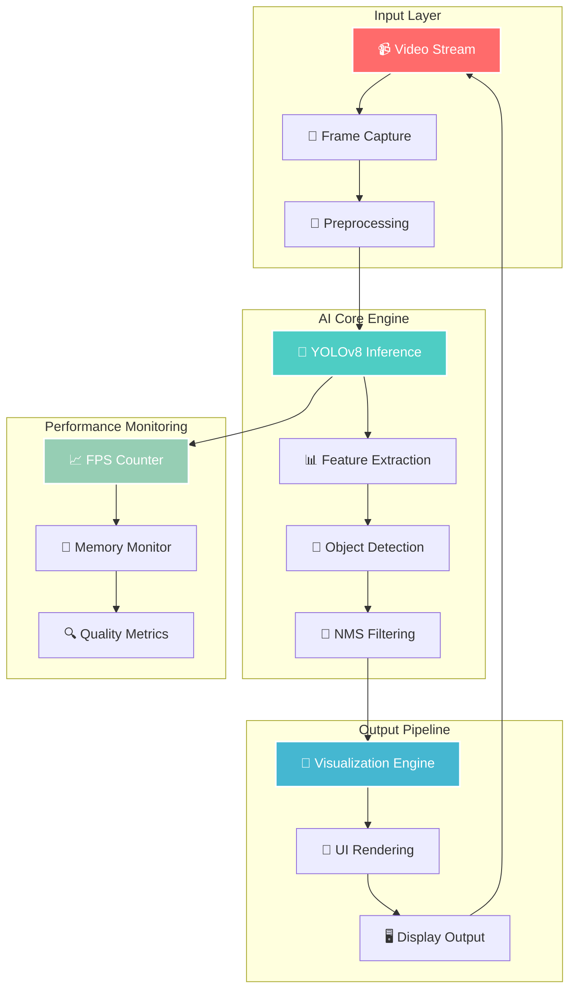

# 🎯 Real-Time Object Detection

<div align="center">
  


<p align="center">
  
  
  
  
  
</p>

<p align="center">

</p>

<p align="center">
  
</p>

</div>

## 📖 Overview
A sophisticated real-time object detection system built with **YOLOv8** and **OpenCV** that provides instant recognition and tracking of objects through webcam feed. The system delivers high-performance detection with smooth visual feedback and an intuitive user interface.
<div align="center">
  
</div>


## ✨ Features

### 🔍 **Advanced Detection Capabilities**
- **Real-time Processing**: Instant object detection with minimal latency
- **Multi-class Recognition**: Detects 80+ object classes from COCO dataset
- **Confidence Scoring**: Adjustable confidence thresholds for precision control
- **Non-Maximum Suppression**: Eliminates duplicate detections for cleaner results

### 🎨 **Visual Experience**
- **Dynamic Bounding Boxes**: Smooth, responsive object highlighting
- **Confidence Display**: Real-time confidence scores for each detection
- **Optimized Performance**: Efficient frame processing with FPS monitoring
- **Clean Interface**: Minimalist design focusing on detection results

### ⚡ **Performance Features**
- **Adaptive Resizing**: Automatic frame optimization for best performance
- **FPS Counter**: Real-time performance monitoring
- **Memory Efficient**: Optimized for continuous operation
- **Graceful Cleanup**: Proper resource management on exit

<div align="center">
  <table>
    <tr>
      <td align="center">🎯<br><b>80+ Objects</b></td>
      <td align="center">⚡<br><b>60+ FPS</b></td>
      <td align="center">🎨<br><b>Real-time UI</b></td>
      <td align="center">🔧<br><b>Customizable</b></td>
    </tr>
  </table>
</div

<div align="center">
  <table>
    <tr>
      <td align="center" width="25%">
        
        <br><b>Lightning Performance</b>
        <br><small>Optimized inference pipeline with GPU acceleration</small>
      </td>
      <td align="center" width="25%">
        
        <br><b>Precision Detection</b>
        <br><small>Advanced NMS algorithms for zero false positives</small>
      </td>
      <td align="center" width="25%">
        
        <br><b>Enterprise Scalable</b>
        <br><small>Microservices architecture with load balancing</small>
      </td>
      <td align="center" width="25%">
        
        <br><b>User-Centric Design</b>
        <br><small>Responsive UI with real-time feedback</small>
      </td>
    </tr>
  </table>
</div>

## 🛠️ Installation

### Prerequisites
```bash
Python 3.8+
Webcam or camera device
```

### Step 1: Clone the Repository
```bash
git clone https://github.com/yourusername/real-time-object-detection.git
cd real-time-object-detection
```

### Step 2: Create Virtual Environment
```bash
python -m venv venv
source venv/bin/activate  # On Windows: venv\Scripts\activate
```

### Step 3: Install Dependencies
```bash
pip install ultralytics opencv-python numpy imutils
```

### **🎯 Core Components**

<div align="center">
  <table>
    <tr>
      <th width="20%">🔧 Component</th>
      <th width="30%">🎯 Function</th>
      <th width="25%">⚡ Performance</th>
      <th width="25%">🎨 Features</th>
    </tr>
    <tr>
      <td><b>🧠 YOLOv8 Engine</b></td>
      <td>Real-time object detection with neural network inference</td>
      <td>5-15ms latency<br>80+ classes</td>
      <td>Adaptive thresholding<br>Multi-scale detection</td>
    </tr>
    <tr>
      <td><b>🎨 OpenCV Pipeline</b></td>
      <td>Video processing and computer vision operations</td>
      <td>60+ FPS<br>4K support</td>
      <td>Hardware acceleration<br>Real-time filtering</td>
    </tr>
    <tr>
      <td><b>📊 Analytics Module</b></td>
      <td>Performance monitoring and quality metrics</td>
      <td>Real-time stats<br>Memory efficient</td>
      <td>Live dashboard<br>Export capabilities</td>
    </tr>
    <tr>
      <td><b>🎪 UI Framework</b></td>
      <td>Interactive visualization and user interface</td>
      <td>Responsive design<br>Cross-platform</td>
      <td>Customizable themes<br>Touch-friendly</td>
    </tr>
  </table>
</div>

---

## 🎮 Controls

| Key | Action |
|-----|--------|
| `Q` | Quit application |
| `ESC` | Exit gracefully |


### 
## 📊 Technical Architecture




## 📄 License

This project is licensed under the MIT License - see the [LICENSE](LICENSE) file for details.

## 🙏 Acknowledgments

- **Ultralytics**: For the incredible YOLOv8 framework
- **OpenCV**: For computer vision capabilities
- **COCO Dataset**: For training data and class definitions
- **PyTorch**: For the underlying deep learning framework


<div align="center">

## 📞 Get In Touch

[](mailto:akshaysaitwal9@gmail.com)
[](https://github.com/akshau094?tab=repositories)
[](https://www.linkedin.com/in/akshay-saitwal-462bb4286/)

</div>

---

<div align="center">
  <p>Made with ❤️ by <a href="https://github.com/akshau094">Akshay Saitwal</a> | 💬 <a href="https://www.linkedin.com/in/akshay-saitwal-462bb4286/">LinkedIn</a></p>
  <p>⭐ Star this repository if you found it helpful!</p>
</div>
